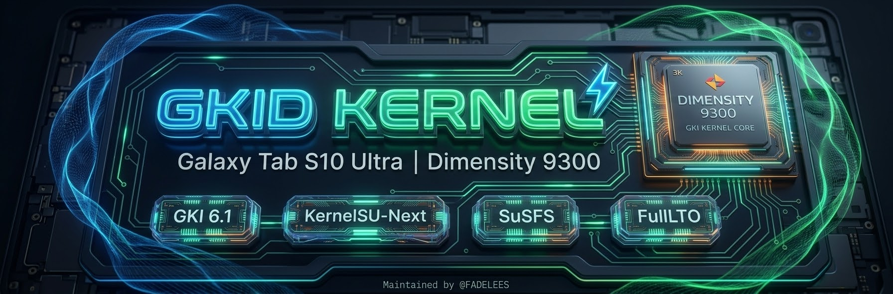

# ⚡ GKID Kernel (Tab S10 Ultra Edition)

  

**⚡ High-performance, low-latency downstream GKI kernel fork** tailored specifically for the **Samsung Galaxy Tab S10 Ultra (MediaTek Dimensity 9300)**. Packed with KernelSU-Next, ReSukiSU, SuSFS, FullLTO, gaming-oriented scheduler tunings, and enhanced deep-sleep battery optimizations.

---

## 📌 About This Fork

> [!NOTE]
> This repository is an independent **downstream fork** of the original [GKID-Kernels by ahmed-alnassif](https://github.com/ahmed-alnassif/GKID-Kernels). 
> - While upstream targets generic multi-version GKI devices, **this fork is specifically refactored, stripped of obsolete patches, and finely tuned for the MediaTek Dimensity 9300 All-Big-Core architecture and UFS 4.0 storage on the Galaxy Tab S10 Ultra.**
> - Full credit goes to **Ahmed Al-Nassif** and the upstream Android Common Kernel (ACK) contributors.

---

## ⚡ Quick Start

1. **Check** your kernel version in Settings → About Tablet / Phone
2. **Download** matching variant package from [Releases](https://github.com/ifoknr/GKID-Kernels/releases)
3. **Flash** using [Kernel Flasher](#-installation-guide-kernel-flasher) *(Always back up your stock boot image first!)*
4. **Manage** SuSFS with [ReSuSFS](https://github.com/ahmed-alnassif/ReSuSFS) or [BERNE - SUSFS](https://github.com/rrr333nnn333/BRENE)

---

## 📱 Target Device & Specifications

| Property | Details |
| :--- | :--- |
| **Tested Device** | Samsung Galaxy Tab S10 Ultra (Wi-Fi & 5G variants) |
| **Kernel & OS** | Linux GKI 6.1 (Android 14) |
| **SoC** | MediaTek Dimensity 9300 (4× Cortex-X4 + 4× Cortex-A720) |
| **GPU** | ARM Immortalis-G720 MC12 |
| **Storage Type** | UFS 4.0 (F2FS `/data` partition) |
| **Kernel Base** | Android Generic Kernel Image (GKI) |

---

## 🧩 Integrated Patches & Versions

| Kernel Patch | Version | Purpose & Integration Details |
| :--- | :--- | :--- |
| **KernelSU-Next (Kernel Patch)** | `v3.4.0` | Kernel-space su implementation with modern syscall hooks and low overhead. |
| **SuSFS (Kernel Patch)** | `v1.5.5` | Kernel-level VFS hiding and mount isolation against hardware root detection. |
| **TCP BBRv3** | `v3 (Upstream backport)` | Google's congestion control algorithm for minimal jitter and stable gaming ping. |

---

## 🔑 Root Management

| Manager / Tool | Version | Purpose & Direct Links |
| :--- | :--- | :--- |
| [**KernelSU-Next Manager**](https://github.com/KernelSU-Next/KernelSU-Next/releases/tag/v3.4.0) | `v3.4.0` | Official app to manage root permissions, grants, and standalone modules. |
| [**ReSukiSU Manager**](https://github.com/ReSukiSU/ReSukiSU/releases) | `Latest Release` | Enhanced manager supporting multi-manager setups and advanced root control. |
| [**ReSuSFS WebUI**](https://github.com/ahmed-alnassif/ReSuSFS/releases) | `Latest Release` | WebUI and module interface for configuring SuSFS hiding scripts and toggles. |
| [**BERNE - SUSFS**](https://github.com/rrr333nnn333/BRENE) | `Latest Release` | Dedicated companion script and profile manager for automated SuSFS setup. |

---

## ⚡ Performance & Gaming

| Feature | Description |
| :--- | :--- |
| **Aggressive EAS Tuning** | Tuned `sugov_ext` rate limits for instant CPU frequency ramp-up during frame spikes. |
| **All-Big-Core Thread Affinity** | Prioritizes render and game engine threads directly onto Cortex-X4 cores. |
| **Zero-Overhead UFS 4.0 I/O** | `none` I/O scheduler bypasses queue latency on ultra-fast UFS 4.0 storage. |
| **F2FS GC Suppression** | Silences aggressive garbage collection during active screen-on time to eliminate micro-stutters. |
| **Optimized zRAM Overhead** | Tuned memory compression parameters to eliminate CPU decompression stalls during heavy loads. |
| **Stripped Debug Overhead** | Disabled `CONFIG_FTRACE`, debugfs, and excess tracing bloat to free raw CPU cycles for games. |
| **FullLTO Compilation** | Built with Full Link-Time Optimization via Clang/LLVM for maximum pipeline efficiency. |

**What this means for you:**
- Rock-solid 120 FPS in competitive titles (*Call of Duty: Mobile*, etc.)
- Zero micro-stutters during intensive combat and scene rendering
- Snappier app launch times and instant touch response
- Eliminates I/O bottlenecks without wearing down flash storage

---

## 🔋 Battery Life

| Feature | Description |
| :--- | :--- |
| **Wakelock Ceiling** | Enforced 500ms wakelock limit to prevent runaway background service drain. |
| **Freeze Timeout** | Reduced task freeze timeout (20s → 1s) for faster sleep entry and deadlock detection. |
| **F2FS Sleep Tuning** | Minimized idle Garbage Collection cycles to save power when the device is idle. |
| **Alarm Timers** | Coalesced non-urgent background wakeups to reduce active wake periods. |
| **Suspend Engine** | Optimized platform-level suspend/resume routines for minimal screen-off drain. |

**What this means for you:**
- Exceptional standby time and minimal overnight battery drop
- Cool and efficient operation during multi-tasking
- Long gaming sessions without sudden thermal throttling cliffs
- Dependable all-day battery endurance

---

## 🌐 Networking

| Feature | Description |
| :--- | :--- |
| **TCP BBRv3** | Default congestion control algorithm for low-latency network performance. |
| **FQ CoDel** | Fair queuing with controlled delay to combat bufferbloat. |
| **IP Set & Netfilter** | Advanced firewall and packet filtering capabilities. |
| **IPv4/IPv6 WireGuard** | High-performance VPN tunneling support directly inside the kernel. |

---

## 🛡️ Security & Root Hiding

| Feature | Description |
| :--- | :--- |
| **KernelSU-Next & ReSukiSU** | Reliable kernel-based root supporting modern APIs and flexible manager environments. |
| **SuSFS Integration** | Advanced filesystem and mount hiding against app-level integrity checks. |
| **SUS MAP/PATH/MOUNT** | Kernel-level isolation preventing path detection by banking and integrity apps. |
| **Play Integrity Ready** | Compatible with modern attestation frameworks and device verification modules. |

---

## 📥 Downloads & Artifacts

All releases are available on the [**GitHub Releases**](https://github.com/ifoknr/GKID-Kernels/releases) page:

* 📦 **`GKID-Kernel-*.zip`**: Flashable archive configured for direct app deployment (Recommended).
* 🖼️ **`boot-*.img`**: Raw GKI boot partition image for recovery/manual backup restoration.

---

## 🛠️ Installation Guide (Kernel Flasher)

> [!CAUTION]
> **MANDATORY BACKUP REQUIRED BEFORE FLASHING:**  
> Modifying your kernel involves risks. **You MUST back up your stock `boot` (and `init_boot` if present) partition before flashing.** If you encounter a bootloop, restoring your backup via Kernel Flasher or fastboot is your safe return path.

### Requirements & Compatibility:
* **Tested & Verified Device:** Tested and confirmed running with rock-solid stability on the **Samsung Galaxy Tab S10 Ultra** on **Linux Kernel 6.1 (Android 14)**.
* **GKI 6.1 Compatibility:** As a Generic Kernel Image, this build is fully compatible and safe to flash on **ANY Android device running Linux Kernel 6.1 on Android 14**.
* **Root Access:** Root privileges via KernelSU-Next, ReSukiSU, or Magisk.
* **Flashing Tool:** **Kernel Flasher** app by *fatalcoder524*: [Download Kernel Flasher v1.6.0+](https://github.com/fatalcoder524/KernelFlasher/releases).

### Flashing Steps:

1. **Take a Backup First:**
   - Open **Kernel Flasher** and grant it Superuser (Root) permissions.
   - Navigate to the **Backup** tab.
   - Tap **Create Backup** to dump your stock boot image to your internal storage. Keep this safe!
2. **Flash the Kernel Zip:**
   - Download the latest **`GKID-Kernel-*.zip`** from [Releases](https://github.com/ifoknr/GKID-Kernels/releases).
   - In **Kernel Flasher**, go to the **Flash** section and select the downloaded `.zip` file.
   - Review the flashing log and ensure the script finishes with success (`Done!`).
3. **Reboot:**
   - Tap **Reboot** to restart your device.
   - Verify kernel installation in **Settings → About Tablet → Software Information → Kernel Version**.

---

## 💬 Community & Support

- **Telegram Support:** [@FADELEES](https://t.me/FADELEES)
- **Issue Tracker:** [GitHub Issues](https://github.com/ifoknr/GKID-Kernels/issues)
- **Original Upstream Project:** [ahmed-alnassif/GKID-Kernels](https://github.com/ahmed-alnassif/GKID-Kernels)

---

## 📄 License

Distributed under the GNU General Public License v2 (GPL-2.0). See [LICENSE](LICENSE) for more details.
